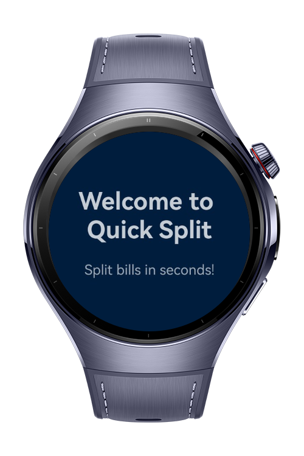
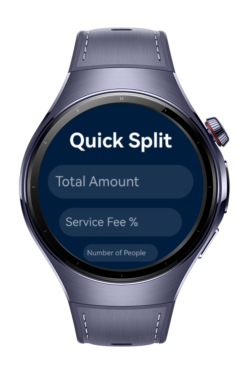
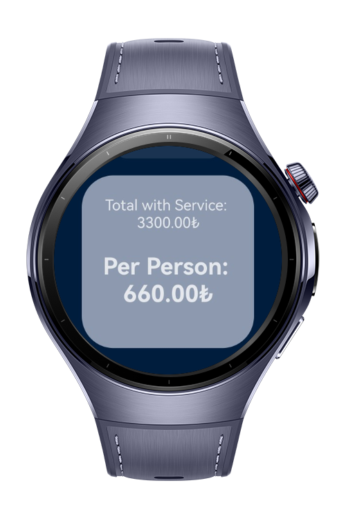

> **Note:** To access all shared projects, get information about environment setup, and view other guides, please visit [Explore-In-HMOS-Wearable Index](https://github.com/Explore-In-HMOS-Wearable/hmos-index).

# QuickBillSplit

QuickBillSplit is a lightweight demo application that helps users quickly split a bill among friends by calculating each
person's share based on the total amount, service fee, and number of people.

# Preview

<p align="left">
  
  
  
</p>

# Use Cases

QuickSplit allows users to:

- Enter a total bill amount.
- Add an optional service fee.
- Select the number of people sharing the bill.
- Instantly compute the per-person cost with a clean and modern UI.

# Tech Stack

Languages: ArkTS  
Frameworks: HarmonyOS SDK 5.1.0 (API 19)
Tools: DevEco Studio 5.1.0.820
Libraries: @kit.ArkUI

# Directory Structure

```
entry/src/main/ets/
   |---entryability
   |   |---EntryAbility.ets
   |---entrybackupability
   |   |---EntryBackupAbility.ets
   |---pages
   | |---Index.ets
   | |---QuickSplit.ets
   |---viewmodel
   | |---SplitViewmodel.ets
```

# Constraints and Restrictions
## Supported Devices
Huawei Watch 5

# LICENSE

QuickBillSplit is distributed under the terms of the MIT License.  
See the [LICENSE](/LICENSE) for more information.
